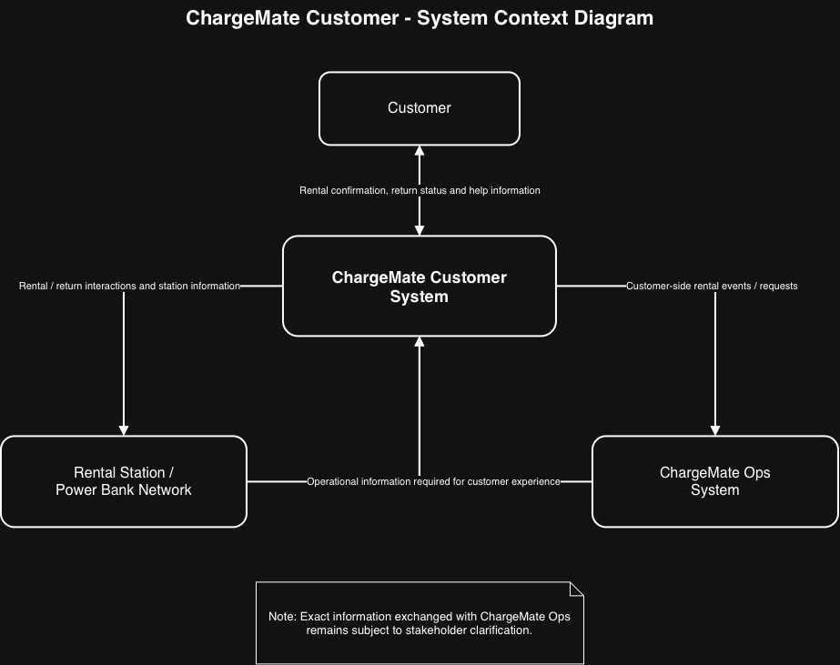

# A1 Submission including Software Requirements Specification

> [!info] 2026 SRS starting point
> This is the confirmed SRS skeleton for the linked project. The A1 package is one PDF plus one video; verify the 50-page limit and all rubric-level requirements against the released A1 specification.

> Use this Markdown file to create the report and include it in the single A1 PDF submitted through iLearn. The existing template specifies an absolute maximum of 50 A4 pages including title pages, diagrams and the table of contents; apply that limit only if it is retained in the released 2026 A1 specification.

> Use the document structure below. You may, if you wish, split the file up into multiple files to make the management easier. You can then leverage some GitHub automation to 'assemble' your file and or generate the PDF.

> 1. SRS
> 2. Group Activity Record
> 3. Appendices

## SRS Structure

### Title Page

# ChargeMate Customer

## Team A Members
* **Cooper Went** 
* **Isaac Lynn** 
* **Yousef Mustafa** 
* **Harrison McLuckie** 

ChargeMate provides a seameless power bank rental service to customers of Harbour North Plaza. Our aim is to get customers to reduce their battery related anxieties and offer a pleasant shopping experience. ChargeMate offers self-serve rental kiosks to reduce any need for employees, limiting any extra operational costs to the establishment.

- Project name, names of all team members
- Vision statement 

### Table of Contents

* [Change Log](#change-log)
* [Introduction](#introduction)
* [Scope](#scope)
* [Overall Description](#overall-description)
* [Product Perspective](#product-perspective)
* [Product Functions](#product-functions)
* [User Characteristics](#user-characteristics)
* [Constraints](#constraints)
* [Assumptions and Dependencies](#assumptions-and-dependencies)
* [Specific Requirements](#specific-requirements)
* [Use Cases and Interactions](#use-cases-and-interactions)
* [Group Activity Records](#group-activity-record)
* [Discussion](#discussion)
* [Invidiual Contributions](#individual-contributions)
* [Appendices](#appendices)

### Change Log
**In Progress**
- A list or table of versions with
  - The date of a new version
  - What has been changed
  - Who made the changes and
  - Who agreed to the changes

### Introduction

**Purpose**
- This document provides the software requirements specifications of ChargeMate for ChargeMate Customer. The document will lay out and explore all functional/non-functional requirements and specific operational costs and constraints. The intent is to establish the groundwork of the system, and a baseline for the development and testing of ChargeMate in correspondence with the OPS side managed by Team B.

### Scope
**ChargeMate Customer**

- Rental & Return: Web app/station interface for scanning station QR codes, selecting rental duration, authorizing payments, and unlocking/returning power banks.
- Availability: Displaying real-time station locations, available charged units, and open return slots across Harbour North Plaza.
- Transparent Pricing & Status: Clear display of pricing structures, active rental timers, hold/deposit fees, and late return policies.
- Self-Service Support: Built-in help, FAQs, reporting feature for damage, and AI queries for complex questions/support.
- Team B Integration: Handing off rental requests, unit release triggers, payment events, and hardware status updates to the operator backend.

**ChargeMate Ops**
- Operations & Maintenance: Kiosk diagnostics, hardware servicing tools, power bank tracking(damage, battery health), and inventory management 
- Logistics: field staff management(repairs, renewal of powerbanks).
- Business Analytics: Revenue monitoring, usage trends.
- Hardware Firmware: Power bank lock mechanisms and physical bay charging, battery percentage

- Definitions, acronyms, and abbreviations. These should be specific to your project.

### Overall Description:

#### Product Perspective

ChargeMate Customer is the customer-facing part of the ChargeMate power bank rental service at Harbour North Plaza. It is intended to help customers find, rent, use, and return portable power banks with minimal assistance from shopping-centre staff.

The system will operate alongside the physical rental stations, power banks, and the ChargeMate Ops system being specified by Team B. ChargeMate Customer may depend on ChargeMate Ops for information such as station and power bank status, although the exact information exchanged between the two systems still requires stakeholder clarification.

Staff operations, station maintenance, power bank redistribution, and operator reporting are outside the scope of ChargeMate Customer.

**Figure 1: ChargeMate Customer System Context Diagram.** The diagram illustrates the system boundary and the high-level interactions between ChargeMate Customer, customers, the rental station network, and ChargeMate Ops.

#### Product Functions

At a high level, ChargeMate Customer should allow customers to:

- Locate ChargeMate rental stations within Harbour North Plaza.
- Check whether a suitable power bank is available.
- View relevant rental and pricing information before beginning a rental.
- Start a power bank rental.
- View information about an active rental.
- Return a rented power bank.
- Receive confirmation when a rental or return has been completed successfully.
- Access clear help or support information if a problem occurs.

The exact rental, payment, return, and notification processes will be refined through further stakeholder consultation.

#### User Characteristics

ChargeMate Customer may be used by a wide range of visitors to Harbour North Plaza, including shoppers, commuters, cinema visitors, library visitors, medical-centre visitors, and people attending weekend events.

Users may have different levels of technical experience and familiarity with the service. Some customers may be in a hurry, while others may only use ChargeMate once. Customers may also have concerns about payment, deposits, late fees, privacy, or what happens when a station does not operate correctly.

For this reason, the customer experience should aim to be clear, simple, and easy to understand without requiring extensive previous knowledge of the system.

#### Constraints

**C-01:** ChargeMate Customer must remain focused on the customer-facing rental experience. Staff operations and maintenance functions are outside its scope.

**C-02:** The system should minimise the need for Harbour North Plaza customer-service staff to resolve routine technology or rental problems.

**C-03:** The rental process should avoid creating an unnecessarily large sign-up process for customers.

**C-04:** Some ChargeMate Customer functions depend on information provided by the physical rental stations and ChargeMate Ops.

#### Assumptions and Dependencies

**A-01:** It is assumed that the wider ChargeMate system can determine whether a station currently has a power bank available for rental.

**A-02:** It is assumed that the wider ChargeMate system can determine whether a station can accept a returned power bank.

**A-03:** ChargeMate Customer will depend on ChargeMate Ops for some operational information. The exact information exchanged between the two systems is still to be confirmed with Team B.

**A-04:** The exact pricing and payment model has not yet been confirmed with the stakeholders.

**A-05:** Whether customers may return a power bank to a station different from the station where it was rented has not yet been confirmed.

**A-06:** Whether customers require an account or may rent using a guest or minimal-registration process has not yet been confirmed.

### Specific Requirements

- Functional requirements:
  - A detailed description of each specific function that the software must perform.
  - Structure this section by any breakdown method you wish, e.g. by user, role, function, and system mode.
- Non-functional requirements: Specifies constraints and expectations with respect to the system's behaviour
  
> Make sure each requirement is uniquely numbered (identifiable), feasible, measurable, testable, and not in conflict with other requirements.

> Be sure that for each requirement listed, you include _Fit criteria_ which details what measures any tests of the system need to pass to be deemed to meet the requirement.

### Use cases and interactions

1. A complete Use Case diagram.
2. Select the 3 "most important" use cases and create a full use case description for each (total 3 use case descriptions).
3. Interaction diagram for each the most important use cases listed in 2. (total 3 interaction diagrams).

## Group Activity Record

### Discussion

- Elicitation Methods: Explaining what techniques you used to elicit the requirements you've reported. This is very important. Be sure to include a fair amount of detail.
  
- Outlook: How you would, if you were continuing the project, further develop the requirements. What other information do you need, and how do you think you could get it? What would you do to be sure that you have the "right" requirements?

### Individual Contributions

- Outline what each team member has led, contributed to, discussed, and/or reviewed.

## Appendices

- log of interactions with stakeholders (minutes from stakeholder comms).
- log of interactions with team members (minutes from all team meetings and discussions - be they in person, chats, or online).
- References.
- Third-party-resources

> Based on the information in the minutes with the stakeholders and on the documentation of third-party resources, but condensed to itemised lists.
